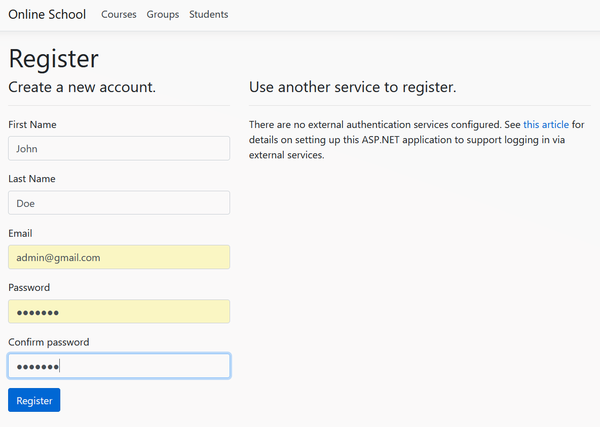

# ASP.NET Core MVC application

The repository contains my work on self-completion of a study Task 
while taking specialized online courses for training C# developers.

An experienced Mentor checked the result and made his remarks on 
the quality of the work performed. The Task could not be completed 
until the Mentor decided that the result was up to industry standards.

The commit called “First implementation of the Task” is my original 
implementation, without any hints. All subsequent commits (if any) 
are the results of my attempts to solve Mentor's remarks and his 
suggestions for improvement the work.

According to the conditions of the school, the Mentor does not provide 
ways to solve shortcomings and sources of information. The search for 
the necessary educational information was carried out independently.
<br/><br/>

## Task Conditions

Create ASP.NET Core MVC application for output data from Task6 (SQL):

* On default page - show list of courses. When the course is selected - 
show a list of groups for the selected course. When the group is 
selected - show a list of students for the selected group.

* Separate from for editing group data (group name).

* Separate from for editing student data (name).

* Group can not be deleted if there is at least one student in this group.
<br/><br/>

## Solution Structure


<br/><br/>

## Prerequisites

Microsoft Visual Studio 2019 or newer

* Workloads<br/>
    * ASP.NET and web development

- Individual components<br/>
    - .NET Core 3.1 Runtime (LTS) 
<br/><br/>

## Getting Started

__1.__ Clone the remote repository on your local machine.<br/>
`$ git clone https://github.com/Shkurlatov/ASP.NET-Core-MVC-application.git`
<br/><br/>
__2.__ Go to the project directory.<br/>
`$ cd ASP.NET-Core-MVC-application`
<br/><br/>
__3.__ Open project solution in Microsoft Visual Studio.<br/>
`$ start Task9.sln`
<br/><br/>
__4.__ In the __Solution Explorer__ choose and right-click __School.Web__ project.


<br/><br/>
__5.__ In the drop-down menu that appears, select __Set as Startup Project__.


<br/><br/>

## Database

LocalDB:
<br/>
* Is a lightweight version of the SQL Server Express Database Engine, installed by default with Visual Studio.
* Starts on demand by using a connection string.
* Is targeted for program development. It runs in user mode, so there's no complex configuration.
* By default creates *.mdf* files in the *C:/Users/{user}* directory.
<br/>

The name and method of creating the database can be changed by editing `ConnectionStrings` in the __appsettings.Development.json__ file.


<br/><br/>
The initial name of the database is __OnlineCourses__. 
```json
  "ConnectionStrings": {
    "DefaultConnection": "Server=(localdb)\\mssqllocaldb;Database=OnlineCourses;Trusted_Connection=True;MultipleActiveResultSets=true"
  },
```
<br/>

## First run


For the first time, certificate and application trust warning messages may 
appear from the IDE and browser.
<br/><br/>
Also, the first launch may take longer due to the process of creating and 
populating the database.
<br/><br/>
The application assumes that there is only one user authorized in the Admin 
role, with full access to all program functions. The first logged in user 
will automatically become an Admin. All subsequent authorized users receive 
the Curator role.
<br/><br/>

## Usage

Launch the app in debug mode by selecting the __IIS Express__ button.


<br/>

Any user, even if not authorized, immediately gets access to view all data 
about __Courses__, __Groups__ and __Students__.


<br/>

Each table can be searched by applying a filter.


<br/>

To register a new authorized user, open the registration window by clicking 
__Register__ in the upper right corner. When registering a user, use any 
imaginary email address.


<br/>

The application is running in demo mode and email confirmation is simulated 
by simply clicking a link on the confirmation page.


<br/>

After registration, click __Login__ in the upper right corner. Log in to 
the created account.


<br/>

If several users are registered in the system, then only the first 
registered user has administrator rights. The Admin can see other users 
in the __Curators__ tab, and if necessary, remove any of them.


<br/>

Also, the Administrator can appoint the Curator responsible for a particular Group.


<br/>

The administrator can delete any object from the database.


<br/>

But only if this object is not referenced by some other entity lower in the hierarchy.

